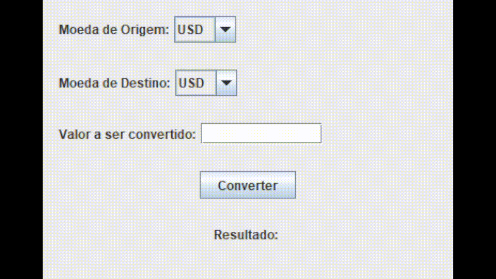

# Conversor de Moedas API

Este é um projeto de Conversor de Moedas que utiliza a API da [ExchangeRate-API]
(https://www.exchangerate-api.com/)para obter taxas de câmbio e converter valores
entre diferentes moedas. O projeto está implementado em Java e
utiliza o cliente HTTP nativo (`HttpClient`) e a biblioteca Gson para trabalhar com JSON.

# Funcionalidades

- Consultar as taxas de câmbio de diversas moedas.
- Converter valores de uma moeda para outra com base nas taxas mais recentes.
- Modularização do código com classes dedicadas para serviços de API e conversão de moedas.

# Tecnologias Utilizadas

- Java 11+ (ou versões mais recentes)
- HttpClient para requisições HTTP.
- Gson** para manipulação de JSON.
- ExchangeRate-API para obter as taxas de câmbio.

# Pré-requisitos

Antes de executar o projeto, certifique-se de ter as seguintes ferramentas instaladas:

- [Java JDK 11+](https://www.oracle.com/java/technologies/javase-jdk11-downloads.html)
- [Maven](https://maven.apache.org/) (opcional, se você usar Maven para gerenciamento de dependências)

# Configuração

1. Clone o repositório:

```bash
git clone https://github.com/jrmesquita7/encriptgit
cd nome-do-repositorio
```

2. Crie um arquivo chamado `config.properties` na raiz do projeto e adicione sua chave de API da ExchangeRate API:

```properties
API_KEY=coloque_sua_api_key_aqui
```

3. Certifique-se de que o arquivo `config.properties` está no seu `.gitignore` para que ele não seja enviado ao Git:

```bash
echo "config.properties" >> .gitignore
```

4. Compile e execute o projeto:

```bash
javac -d out src/*.java
java -cp out br.com.jr.conversor.main.Main
```

## Exemplos de Uso

### Consulta de br.com.jr.conversor.service.Taxas de Câmbio

Você pode usar o serviço para buscar taxas de câmbio com base em uma moeda de origem:

```java
import br.com.jr.conversor.service.Taxas;
import br.com.jr.conversor.service.TaxasService;

TaxasService taxasService = new TaxasService();
Taxas taxas = taxasService.conversao("USD"); // Exemplo: USD para outras moedas
```

### Conversão de Moedas

Após obter as taxas de câmbio, você pode realizar a conversão de valores entre diferentes moedas:

```java
double valorConvertido = taxasService.converter("USD", "BRL", 100.0, taxas); 
System.out.println("Valor convertido: " + valorConvertido + " BRL");
```

Exemplo de output:

```plaintext
Valor convertido: 550.48 BRL
```

### br.com.jr.conversor.menu.Menu Interativo

O projeto inclui uma interface de menu interativa que permite ao usuário selecionar moedas e realizar conversões diretamente do terminal:

```bash
*********************************************
Seja bem vindo/a ao Conversor de Moedas =]
1) Dólar => Peso Argentino
2) Peso Argentino => Dólar
3) Dólar => Real Brasileiro
4) Real Brasileiro => Dólar
5) Dólar => Peso Colombiano
6) Peso Colombiano => Dólar

7) Escolher Manualmente
8) Histórico
9) Sair
Escolha uma opção válida:
```

### Exemplo de Execução

Ao selecionar uma opção, o usuário será solicitado a inserir um valor para conversão, e o resultado será exibido no terminal. Exemplo de fluxo:

```bash
Escolha uma opção válida:
1
Digite o valor a ser convertido:
100
Valor 100.0 USD corresponde ao valor final de =>>> 13300.0 ARS
```

Caso escolha manualmente digite por exemplo: BRL, EUR e escolha o valor 

```bash
Escolha uma opção válida:
7
Qual moeda será a base?
brl
Para qual moeda será a conversão?
eur
Digite o valor da conversão:
100
Valor convertido: 16,38 EUR
```

Todas as informações ficam gravadas em um arquivo log, exemplo dos dados:

```bash
Valor: 23.0 em USD convertido para 22526.66 em ARS 2024-10-12 00-14-59
Valor: 34.0 em BRL convertido para 6.0927999999999995 em USD 2024-10-12 00-15-06
Valor: 34.0 em BRL convertido para 6.0927999999999995 em USD 2024-10-12 00-15-32
Valor: 33.0 em COP convertido para 0.00778767 em USD 2024-10-12 00-15-39
Valor: 788.0 em COP convertido para 0.18596012 em USD 2024-10-12 00-18-50
Valor: 10.0 em USD convertido para 42374.637 em COP 2024-10-12 00-22-31
Histórico gerado 2024-10-12 00-22-33
Valor: 22,00 em ARS convertido para 0,02 em USD 2024-10-12 00-28-38
Valor: 899,00 em USD convertido para 5016,42 em BRL 2024-10-12 00-32-03
Valor: 100,00 em USD convertido para 558,00 em BRL 2024-10-12 00-32-12
Histórico gerado 2024-10-12 00-32-20
Valor: 0,00 em BRL convertido para 0,00 em USD 2024-10-12 02-57-58
Valor: 10,00 em BRL convertido para 1,79 em USD 2024-10-12 03-02-15
Valor: 10,00 em USD convertido para 9794,20 em ARS 2024-10-12 03-07-58
Valor: 100,00 em USD convertido para 558,00 em BRL 2024-10-12 03-08-16
Histórico gerado 2024-10-12 03-08-38
Valor: 22,00 em USD convertido para 122,76 em BRL 2024-10-12 03-10-13
Histórico gerado 2024-10-12 03-10-17
Valor: 55,00 em BRL convertido para 9,86 em USD 2024-10-12 03-11-10
Valor: 54,00 em COP convertido para 0,01 em USD 2024-10-12 03-11-13
Valor: 55,00 em BRL convertido para 9,86 em USD 2024-10-12 03-11-40
Valor: 34,00 em USD convertido para 189,72 em BRL 2024-10-12 03-13-14
Valor: 11,00 em BRL convertido para 1,97 em USD 2024-10-12 03-13-31
Histórico gerado 2024-10-12 03-13-40
Valor: 54,00 em BRL convertido para 9,68 em USD 2024-10-12 03-16-40
Valor: 100,00 em ARS convertido para 432,65 em COP 2024-10-12 03-16-53
Histórico gerado 2024-10-12 03-16-59
Valor: 12,00 em BRL convertido para 2,15 em USD 2024-10-12 10-40-48
Valor: 100,00 em BRL convertido para 16,38 em EUR 2024-10-12 10-42-51
Valor: 100,00 em BRL convertido para 16,38 em EUR 2024-10-12 10-44-11
Valor: 100,00 em EUR convertido para 610,34 em BRL 2024-10-12 10-44-29
Histórico gerado 2024-10-12 10-44-37
Valor: 100,00 em USD convertido para 423746,37 em COP 2024-10-12 10-46-30
Valor: 12,00 em AFN convertido para 16,02 em ALL 2024-10-12 10-48-10
Valor: 100,00 em USD convertido para 97942,00 em ARS 2024-10-12 11-24-01
Valor: 1000,00 em ARS convertido para 1,02 em USD 2024-10-12 11-24-20
Valor: 100,00 em BRL convertido para 16,38 em EUR 2024-10-12 11-24-57
Histórico gerado 2024-10-12 11-25-18
```

Para uma experiência diferente no diretório root/ui/ a class ConversorMoedasUI
trás uma interface grafica para melhor o funcionamento,
Essas foram as bibliotecas utilizadas 

```
import javax.swing.*;
import java.awt.*;
import java.awt.event.ActionEvent;
import java.awt.event.ActionListener;
```



## Contribuições

Contribuições são bem-vindas! Se você deseja melhorar o projeto, sinta-se à vontade para abrir uma _issue_ ou fazer um _fork_ do repositório e enviar um _pull request_.

## Licença

Este projeto está licenciado sob a [MIT License](https://opensource.org/licenses/MIT).
